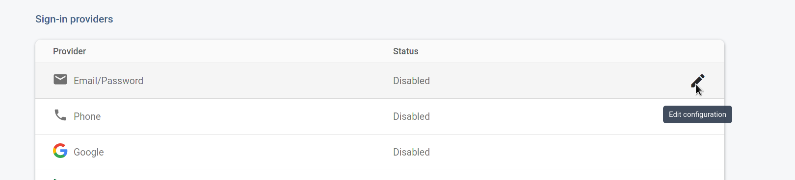

## Deployment Instructions

### Please follow these instructions to deploy a distributed OpenCravat runner in GCP resources. For ease we would recommend you use an incognito window for this deployment to avoid concerns with multiple google accounts in your browser. 

First launch your GCP cloudshell


This will take some time and put you into a bash prompt on a dedicated instance in the GCP environment

For ease you should expand the cloudshell to a larger window.


Once you have your cloudshell running you'll need to clone the repository for this project and change directory into the cloned project

```console
username@cloudshell:~$ git clone git@github.com:kmoad/ocq-deploy.git
username@cloudshell:~$ cd ocq-deploy
```
Edit the config.yml using Nano, VIM, or the visual editor. The visual editor can be accessed with the button below.


```console
username@cloudshell:~$ vim config.yml
```
The file should be modified to contain a new project name after "project:" and any email addresses you would like to have access to the platform. The first user email line is required and will become the administrator, any additional addreses will be configured as standard users.

```console
project: ocq-dep-test-020721
region: us-central1
users:
- user1@gmail.com
- user2@gmail.com
- user3@otheremail.com
```

Ensure the create tool has the correct permissions and run the command
```console
username@cloudshell:~$ chmod 700 create.sh
username@cloudshell:~$ ./create.sh
```
You will initially be asked to approve some package installs in your cloudshell environment - These are necessary to run the creation process, press 'y' to confirm.

```console
user@cloudshell:~/ocq-deploy $ ./create.sh
We need to install a couple of pip packages (oyaml, and google-cloud-firestore) to make this deployment work. Are you ok with this change to your environment? (Please enter 'y' to confirm)
```

The deployment process is interactive from this point. Follow the prompts in the deployment process. The first step will require you to select a billing account by entering the number associated with your preferred account.

```console
Checking for project ocq-dep-test-020721
Creating new project ocq-dep-test-020721
Create in progress for [https://cloudresourcemanager.googleapis.com/v1/projects/ocq-dep-test-020721].
Waiting for [operations/cp.8481877481027657561] to finish...done.
Enabling service [cloudapis.googleapis.com] on project [ocq-dep-test-020721]...
Operation "operations/acf.p2-185908667395-04ede422-6d19-460f-b054-ad0eeb34a22d" finished successfully.
Checking for billing account
Billing account required
Available billing accounts
    [1]    Billing-account-1
    [2]    Billing-account-2
Account number:
```

You will next need to press enter to configure the Firebase portion of the project.

```console
~~~~~~~~~~~~~~~~~~~~~~~~~~~~~~~~~~~~~~~~~~~~~~~~~~~~~~~~~~~~~~~~~~~~~~~~~~~~~~~
This tool uses Firebase to provide authentication, database management, and
cloud storage. Unfortunately, many Firebase services cannot be initialized
without user input. You will be directed to enable some Firebase services in a
browser, and to reply to some command line prompts.
~~~~~~~~~~~~~~~~~~~~~~~~~~~~~~~~~~~~~~~~~~~~~~~~~~~~~~~~~~~~~~~~~~~~~~~~~~~~~~~
Press enter to continue
```
The next section will require you visit a link in your web browser to enable an authentication method for the platform.

```console
~~~~~~~~~~~~~~~~~~~~~~~~~~~~~~~~~~~~~~~~~~~~~~~~~~~~~~~~~~~~~~~~~~~~~~~~~~~~~~~
Open the link below, and enable Email/Password authentication.
Do not enable Email link authentication.
https://console.firebase.google.com/u/0/project/ocq-dep-test-020721/authentication/providers
~~~~~~~~~~~~~~~~~~~~~~~~~~~~~~~~~~~~~~~~~~~~~~~~~~~~~~~~~~~~~~~~~~~~~~~~~~~~~~~
```
Click "Get Started" on the following screen


At the authentication selection screen, configure the "Email/Password" option




Click the first "Enable" option and "Save"


Once that is setting is saved close this window and return to the cloudshell and press enter which will prompt you to configure the database for the platform. Click the link and follow the process documented below.

```console
~~~~~~~~~~~~~~~~~~~~~~~~~~~~~~~~~~~~~~~~~~~~~~~~~~~~~~~~~~~~~~~~~~~~~~~~~~~~~~~
Open the link below, and create a Firestore database with the default settings.
https://console.firebase.google.com/project/ocq-dep-test-020721/firestore
~~~~~~~~~~~~~~~~~~~~~~~~~~~~~~~~~~~~~~~~~~~~~~~~~~~~~~~~~~~~~~~~~~~~~~~~~~~~~~~
Press enter to continue
```

Click "Create Database" to being the process.


Leave the initial setting in 'Production Mode' and select 'Next'


Choose your Firestore location and ensure it matches your project location. The warning present on this window can be ignored and you should select 'Enable'.


Once you have seen the following screen you can close this tab and return to the cloudshell.


The rest of the configuration will take place in the cloudshell terminal window. Be sure not to overwrite files in the process.

Press 'Enter'.

```console
~~~~~~~~~~~~~~~~~~~~~~~~~~~~~~~~~~~~~~~~~~~~~~~~~~~~~~~~~~~~~~~~~~~~~~~~~~~~~~~
Deploying firestore database configuration.
Follow the prmpts to accept the default paths for firestore.rules and
firestore.indexes.json. Do not overwrite the files.
~~~~~~~~~~~~~~~~~~~~~~~~~~~~~~~~~~~~~~~~~~~~~~~~~~~~~~~~~~~~~~~~~~~~~~~~~~~~~~~
Press enter to continue
```
Press 'Enter' 'N' and 'Enter'.

```console
=== Firestore Setup

Firestore Security Rules allow you to define how and when to allow
requests. You can keep these rules in your project directory
and publish them with firebase deploy.

? What file should be used for Firestore Rules? (firestore.rules)
? File firestore.rules already exists. Do you want to overwrite it with the Firestore Rules from the Firebase Console? (y/N)
```
Press 'Enter' 'N' and 'Enter'.

```console
Firestore indexes allow you to perform complex queries while
maintaining performance that scales with the size of the result
set. You can keep index definitions in your project directory
and publish them with firebase deploy.

? What file should be used for Firestore indexes? firestore.indexes.json
? File firestore.indexes.json already exists. Do you want to overwrite it with the Firestore Indexes from the Firebase Console? (y/N)
```

Press 'Enter' twice.

```console
~~~~~~~~~~~~~~~~~~~~~~~~~~~~~~~~~~~~~~~~~~~~~~~~~~~~~~~~~~~~~~~~~~~~~~~~~~~~~~~
Follow the prompts to accept the default path for storage.rules
~~~~~~~~~~~~~~~~~~~~~~~~~~~~~~~~~~~~~~~~~~~~~~~~~~~~~~~~~~~~~~~~~~~~~~~~~~~~~~~
Press enter to continue
=== Storage Setup

Firebase Storage Security Rules allow you to define how and when to allow
uploads and downloads. You can keep these rules in your project directory
and publish them with firebase deploy.

? What file should be used for Storage Rules? (storage.rules)

```
The final interactive session will confirm your previous settings and confirm the final deployment, just press 'Y' to proceed.

```console
Deploying app
Services to deploy:

descriptor:      [/home/username/ocq-deploy/app-engine/app.yaml]
source:          [/home/username/ocq-deploy/app-engine]
target project:  [ocq-dep-test-020721]
target service:  [default]
target version:  [20210207t195621]
target url:      [https://ocq-dep-test-020721.uc.r.appspot.com]


Do you want to continue (Y/n)?
```
If the deployment process completes successfully you will be presented with following stanza including the admin email address and the link to your new platform

```console
~~~~~~~~~~~~~~~~~~~~~~~~~~~~~~~~~~~~~~~~~~~~~~~~~~~~~~~~~~~~~~~~~~~~~~~~~~~~~~~
Deployment finished. Open the link to create an administrator account with the
email below. Then use the admin page to create an annotation worker image. When
the worker image is finished, users may create accounts and submit jobs.
Administrator email: admin-email@gmail.com
App URL: https://ocq-dep-test-020721.uc.r.appspot.com
~~~~~~~~~~~~~~~~~~~~~~~~~~~~~~~~~~~~~~~~~~~~~~~~~~~~~~~~~~~~~~~~~~~~~~~~~~~~~~~
```